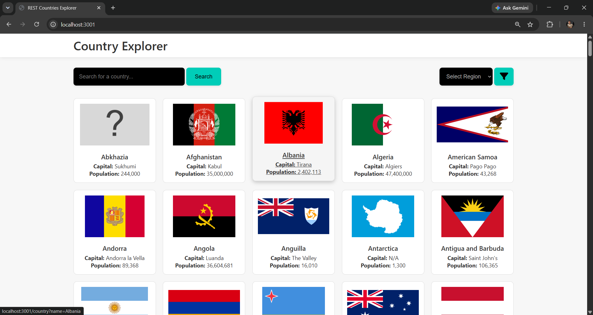
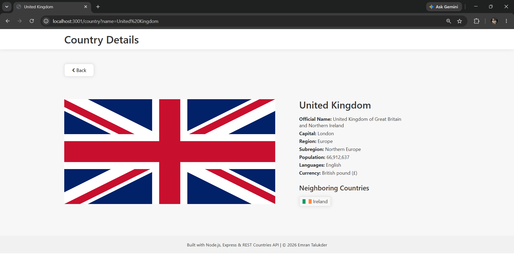

# 🌍 Country Explorer App


A full-stack web application for exploring countries using the **REST Countries API (v5)**.

This project demonstrates a **real-world backend architecture** with:
- API integration with rate limits
- File-based caching system
- Manual cache refresh control
- Live search + filtering
- Clean Express + EJS structure

## 🚀 Features

### 🏠 Home Page
- Displays all countries in responsive cards
- Flag, name, capital, population
- Live search (name-based)
- Region filtering
- Combined filters support

### ⚡ Live Search
- Debounced input handling
- Real-time filtering via `/search`
- No page reload required

### 📄 Country Details Page
Shows full country information:
- Flag (SVG with fallback handling)
- Official & common name
- Capital
- Region & subregion
- Population
- Languages
- Currencies
- Neighboring countries (clickable)

### 💾 Smart Caching System
- Memory cache (fast access)
- File cache (`/cache/countries_cache.json`)
- API fallback only when needed
- Prevents unnecessary API usage

### 🔄 Manual Cache Refresh
```http
POST /refresh-cache
```
- Fetches fresh API data
- Updates memory + file cache
- Gives full control over updates

## 🚨 Why This Project Uses Caching

The REST Countries API introduces real-world constraints that directly influenced the architecture of this project.

### ❗ API Limitations

- Free-tier API has **strict monthly request limits (~500 requests/month)**
- Each request returns only **100 countries max**
- Full dataset (~250+ countries) requires **multiple paginated requests**

### ❗ Problem Without Caching

Without caching:
- Every page reload triggers API calls
- Search and filtering trigger repeated API requests
- API quota would be quickly exhausted
- Performance would be slower due to network dependency


### 💡 Solution Implemented

To solve this, the app uses a **multi-layer caching strategy**:

1. 🧠 Memory Cache (fastest access during runtime)
2. 💾 File Cache (`/cache/countries_cache.json`)
3. 🌐 API Call (only when cache is missing or manually refreshed)


### ⚡ Result

- API is called **only when needed**
- All filtering/search runs locally on cached data
- Near-instant response times after first load
- No risk of hitting API rate limits during normal usage

## 📸 Screenshots

### Home Page


### Live Search
<video src="./public/images/liveSearch.mp4" controls></video>

### Country Details


## ⚙️ Installation

1. Clone the repository
    ```bash
    git clone https://github.com/your-username/country-explorer.git
    cd country-explorer
    ```

2. Install dependencies
    ```bash
    npm install
    ```

3. Create .env file and save the REST countries API key
    ```env
    REST_COUNTRIES_API_KEY=<your_api_key_here>
    ```
    Replace <your_api_key_here> with your 'REST countries' API key.
    > To get an API key, visit "[REST Countries](https://restcountries.com/)"

4. Run the app
    ```bash
    npm start
    ```
    or (if using nodemon):
    ```bash
    npm run dev
    ```

5. Open in browser
    http://localhost:3001

## 🧠 Architecture
/utils  
├── apiClient.js  
├── local_file_cache.js  

/cache  
├── countries_cache.json  

/views  
├── index.ejs  
├── country.ejs  
├── error.ejs  

/public  
├── js/autoSearch.js  
├── css/styles.css  

## 🌐 API Usage

### Uses **REST Countries API v5**:
- Country data
- Flags (SVG)
- Population
- Languages
- Currencies
- Borders
### Important constraints:
- Max 100 results per request
- Requires pagination
- Free-tier request limits (~500/month)

## 🧩 Key Design Decisions
- File cache used as persistent storage
- API only used when cache is missing or refreshed
- Separation of concerns (utils layer)
- Defensive handling of missing API fields
- Optimized to avoid rate limit exhaustion

## 📚 Learning Outcomes
- API pagination handling
- Server-side caching strategies
- Express routing architecture
- File system usage in Node.js
- Debounced live search
- EJS templating with dynamic rendering
- Real-world backend optimization patterns

## 🚀 Future Improvements
- Add authentication for refresh route
- Add automatic cache expiry (TTL system)
- Add Redis caching (production upgrade)
- Add pagination UI
- Add dark mode
- Improve search (fuzzy matching)

## 👤 Author

**Emran Talukdar**

Capstone-style full-stack project focused on backend design, caching strategies, and real-world API handling.